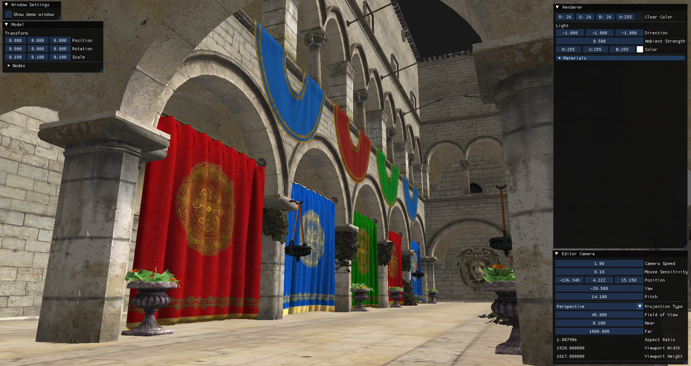
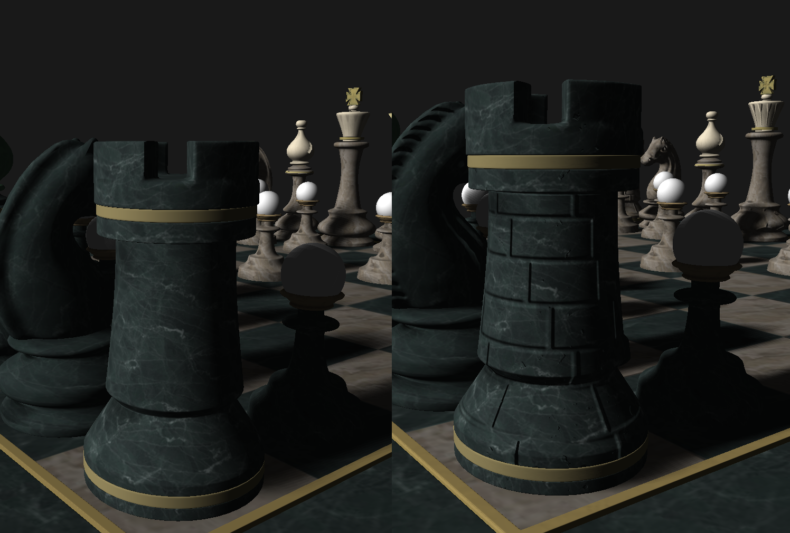
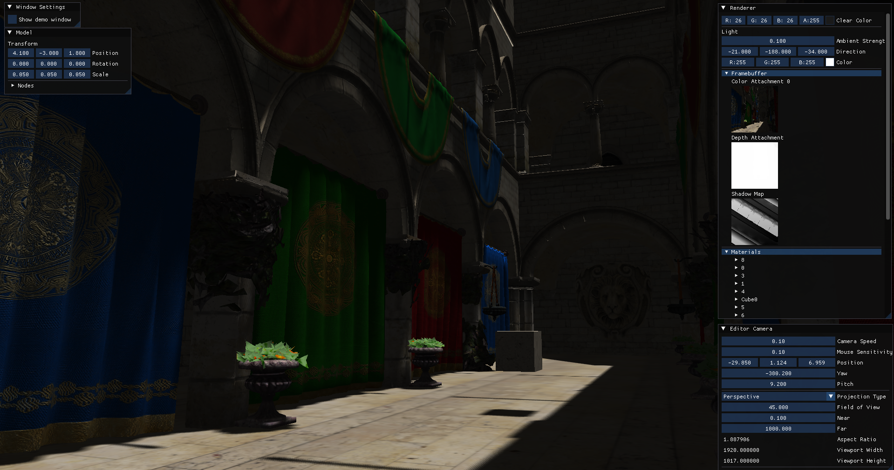
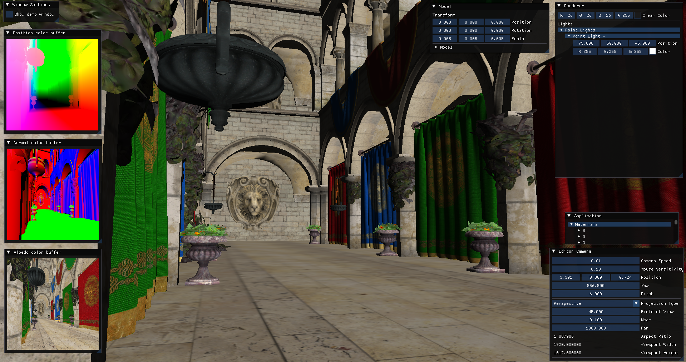

# athena-ogl-engine
This project is created with the purpose of understanding how GPU rendering works. Implementing classic algorithms such as shadow mapping, deferred rendering and PBR.

# Building and Running
## Prerequisites
- C++ Compiler (compatible with C++17 or later)
- CMake (version 3.29 or later)
- Visual Studio (2022)

## Instructions
Clone with version 2.13 of Git or later:
```pwsh
git clone --recurse-submodules -j8 https://github.com/t-dimitrov/athena-ogl-engine/
```
> Note `-j8` is an optional performance optimization which allows fetching of up to 8 submodules in parallel.

Clone with earlier versions of Git:
```pwsh
git clone --recursive https://github.com/t-dimitrov/athena-ogl-engine/
```

### If using Visual Studio
- Open the project by clicking `Open Local Folder`.
### Else build using CMake
```pwsh
cd athena-ogl-engine/
mkdir build
cd build
cmake ../
```

# Features
## OpenGL Object Abstraction
- [x] Vertex array objects
- [x] Vertex buffers
- [x] Index buffers
- [x] 2D textures
- [x] Cubemaps
- [x] Shaders
  - [x] Vertex shader
  - [x] Fragment shader
- [x] Framebuffers
- [x] Uniform buffers

## Rendering
- [ ] Importing glTF models 
  - [x] Reading vertex data
  - [x] Loading textures
  - [ ] Reading pbr material data

- [ ] HDR environment
- [x] Normal mapping

- [x] Shadow mapping

- [ ] Bloom
- [x] Deferred rendering
  - [x] Multiple Light casters
    - [x] Directional light
    - [x] Point light
  - [x] Multiple lights

- [ ] PBR
- [ ] Forward+ rendering

## Engine Subsystems
- [x] Windowing system with [glfw](https://github.com/glfw/glfw)
- [x] Event system
  - [x] Windows events
  - [x] Key events
  - [x] Mouse events
- [x] Logging with [fmt](https://github.com/fmtlib/fmt) 
- [x] Reference counting
- [ ] Benchmarking/Profiling
